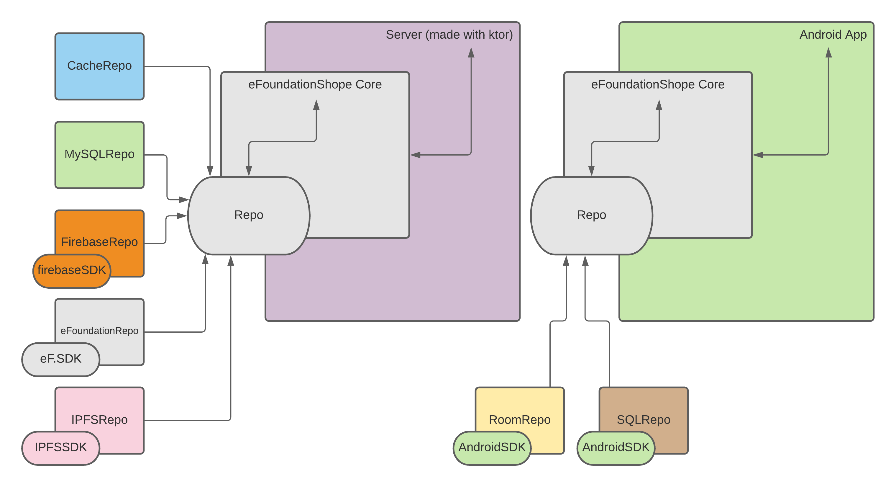

# eFoundation Shop Server

## Introduction
This project aims to implement the eFoundation Shop Api Specification. 
The api resolves around 3 principal models: User, Products, Orders. The users could be either an admin or a customer.

## Development environment

The project was created and developed on a Windows 10 x64 machine, using `IntelLij IDEA 2020.3.2 Community Edition`.
It is recommended to have an OpenApiSpecification client. 
(Initially I have used [Swagger](https://editor.swagger.io/), but then migrated to [Insomnia Designer](https://insomnia.rest/products/designer/))

The file `eShopApi Spec.yml` contains the current version of the api specification.

## How to run
Just run the default gradle configuration with IntelliJ IDEA and the server will start running. 
Note: The host(127.0.0.1) and port(8080) are hardcoded, thus, making dev/prod separation a little harder.

## Architecture of the API
The API specification was made using [OpenAPI](https://www.openapis.org/), and was designed to handle simple http methods for a few endpoints. 
The crucial operation was the `Customer` being able to place an `Order` of some `Product`s.

As far as I know, for optimal user experience, the user should be able to buy without making an account.
To have a system where the user could: Buy -> Create an account to save his data -> Log in later, the whole
system should think about an session, and not about a user. This maybe would help to build the different 
sessions on different computers/smartphones of the user (ex: the user connects with his smartphone, and
his cart information updates on the desktop session).

All endpoints, except of the one who generate the token (who identifies a session), require that the client
sends the token. Even for the simple get operations.

The API also supports other varieties of products. I have thought to myself: Maybe in the future the shop will also
sell other type of products, for example, those little robots that clean our houses. Since one of the eFoundation 
principles is about privacy, maybe they would want to make and sell those robots. Thats why the end points of product
resolve around POST:/product/smartphone or GET:/product, allowing we make extensions to the store, like: 
POST:/product/cleaner_robot and retrieving this information on the GET:/product url.

Note: The API was not design to have a versioning system (ex: HOST:PORT/v1/...), but it probably should have, so we don't
accidentaly break the clients.

## Architecture of the server

The architecture of choice was the 
[Clean Architecture](https://blog.cleancoder.com/uncle-bob/2012/08/13/the-clean-architecture.html), 
because it helps with the separation of concerns, re-usability, testability and maintainability, isolating all 
principal components of our system.

The package `core` is where everything happens, it is the principal component of the whole application. 
Ideally it would be a separated module, but I didn't succeed making it that way. If working on a team,
the `core` module could be extracted away and reused in various locations, which demonstrate one of the key points
of following the Clean Architecture: Re-usability. With this in mind, even though it was not in the requirements,
when developing the core package I was always asking me: Could you reuse this code, on the server side AND 
on, suppose, android application? Yes, you could if it was a separated module, 
which it can be since it does not depend upon anything inside the ktor server (as planned). 
You just need to make a small refactoring.

Below is a diagram of the whole concept:

Note the ktor server side of things, it could be an android app or something else. Essentially making easier
for more people work on the project without too much of conflicts, assuming a good design of models of
the `Core` package.

## Persistence layer
The persistence layer was not implemented yet. Looking at the diagram, only the `CacheRepo` was made. According to
the autor of Clean Architecture, the persistence is a detail and should be prolonged as much as possible the implementation,
however, as will be discussed later, I did not have the time to finish everything that was asked.

## Bugs, features and current state of the server
The server does not validate the token, nor sanitize any of the inputs clients give to him. The way the
requestBody was made was naive when handling a type List<>, potentially causing data inconsistency.
The unit tests uses a Random function (inside the CacheRepository) which a for a automated unit test it probably should 
not use. My first approach was handling myself the id generation of the data to make the test 100% using predictable data, 
but a bug was introduced (and a test caught it). I have spent some time and did not understand why it was happening, and
to satisfy the test and simplify the demonstration, the random function was used across the system.

In no where the server there is a concern for security (A user could even create an Admin account using any token!),
the modification of data (delete and put) mostly was not implemented (only the PUT:/user/cart).
The system mostly does not validate any data, making data inconsistency a real threat.
The API was not designed to handle image data upload, only to save the already existing url which makes the server lose
control over its own data.

Overall, the server is at its most basic, lacking a bunch of must-have items on a production environment.
Currently, I do lack expertise on Authentication mechanisms and data privacy, which brings another reason why the server
does not handle those cases properly (other than that I have run out of time).

## There is no GUI/client
Yes, it was a requirement, but it took-me too much time to design the API and start implementing the server, that the
graphical user interface was not even sketched.

Ideally, to make a great user experience and a pretty interface, I would do as follows: Search with the users thier 
struggles, their pain, what they do, where they do, and how they do things with the technology. An example is this:
Spotify for a computer is totally different from Spotify for cars. Not only the interface, but mostly the experience.
The buttons are large and easy acessible, because the people are driving, the system automatically closes spotify when not
interacting with it (so the driver could see the Maps), etc. Those are really important aspects of designing a good GUI,
and user research should be taken into account. For making a beautiful interface, websites like [Dribbble](https://dribbble.com/)
would be used to gather inspiration and ideas.
